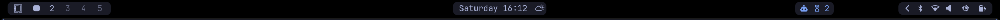

# waybar-herdr

[](https://github.com/carlotran4/waybar-herdr/actions/workflows/ci.yml)
[](LICENSE)

An event-driven [Waybar](https://github.com/Alexays/Waybar) module for [Herdr](https://herdr.dev/). See every coding agent's state at a glance and jump to the agent that needs attention most.



## Features

- Event-driven updates over Herdr's Unix socket—no polling loop.
- Harness-agnostic states normalized by Herdr.
- Compact colored counters for blocked, done, working, unknown, and idle agents.
- Detailed tooltip with agent names and working directories.
- One-click focus for the highest-priority agent.
- Automatic reconnect with bounded exponential backoff.
- Default, named-session, and explicit socket support.
- Optional Hyprland window focusing; status reporting works with any Waybar compositor.
- Python standard library only at runtime.

## Requirements

- Linux or another platform with Unix domain sockets.
- Herdr with the `agent.list`, `agent.focus`, and `events.subscribe` socket APIs.
  Tested with Herdr 0.7.5 (protocol 17).
- Waybar with continuous custom-module support. Tested with Waybar 0.15.0.
- Python 3.10 or newer.
- A Nerd Font for the default icons, or custom icons through environment variables.
- Optional: Hyprland and `hyprctl` to raise the existing Herdr window after focusing a pane.

Install the official Herdr integration for each harness you use for the most reliable lifecycle state. See [Herdr integrations](https://herdr.dev/docs/integrations/).

## Install

Until the first PyPI release, install directly from GitHub:

```sh
pipx install git+https://github.com/carlotran4/waybar-herdr
```

For development:

```sh
git clone https://github.com/carlotran4/waybar-herdr
cd waybar-herdr
uv sync --dev
```

## Configure Waybar

Add the module definition to `~/.config/waybar/config.jsonc`:

```jsonc
"custom/herdr": {
  "exec": "waybar-herdr watch",
  "return-type": "json",
  "restart-interval": 2,
  "hide-empty-text": true,
  "exec-on-event": false,
  "on-click": "waybar-herdr focus-attention",
  "tooltip": true
}
```

Compose it wherever it belongs in your bar:

```jsonc
"modules-right": ["custom/herdr", "network", "battery"]
```

Then copy or adapt [`examples/style.css`](examples/style.css) and restart Waybar.

The module intentionally does not edit your Waybar configuration. Placement, spacing, colors, and surrounding modules remain yours.

## Agent priority

Clicking chooses the first available state in this order:

1. blocked
2. done
3. working
4. unknown
5. idle

When agents share a state, the most recently changed agent wins. `agent.focus` changes Herdr's existing focused pane; it does not create a pane or terminal window.

With `--focus-backend auto`, an existing Herdr window is also raised when running under Hyprland. On other compositors, the pane is focused inside Herdr without trying to create or raise a window.

```sh
waybar-herdr focus-attention --focus-backend none
waybar-herdr focus-attention --focus-backend hyprland --window-title herdr
```

## Sessions and sockets

Use a named Herdr session:

```jsonc
"exec": "waybar-herdr --session work watch",
"on-click": "waybar-herdr --session work focus-attention"
```

Or set `HERDR_SESSION=work`. An explicit `--socket PATH` takes highest precedence, followed by `HERDR_SOCKET_PATH`, then the selected session.

## Customize icons and colors

Defaults use JetBrains Mono Nerd Font-compatible glyphs and a Tokyo Night-inspired palette. Override any value in the Waybar `exec` environment:

| Variable | Purpose |
|---|---|
| `WAYBAR_HERDR_ICON` | Main agent icon |
| `WAYBAR_HERDR_BLOCKED_ICON` | Blocked icon |
| `WAYBAR_HERDR_DONE_ICON` | Done icon |
| `WAYBAR_HERDR_WORKING_ICON` | Working icon |
| `WAYBAR_HERDR_UNKNOWN_ICON` | Unknown icon |
| `WAYBAR_HERDR_IDLE_ICON` | Idle icon |
| `WAYBAR_HERDR_<STATE>_COLOR` | Inline Pango color for a state |
| `WAYBAR_HERDR_FOCUS_BACKEND` | `auto`, `hyprland`, or `none` |
| `WAYBAR_HERDR_WINDOW_TITLE` | Herdr title matched by the Hyprland backend |

Example:

```jsonc
"exec": "WAYBAR_HERDR_BLOCKED_COLOR='#ff5555' waybar-herdr watch"
```

## CLI

```text
waybar-herdr [--socket PATH] [--session NAME] watch
waybar-herdr [--socket PATH] [--session NAME] once
waybar-herdr [--socket PATH] [--session NAME] focus-attention [options]
```

`once` is useful when validating Herdr connectivity and your font:

```sh
waybar-herdr once | jq
```

## How it works

On startup, the module calls `agent.list`, emits one Waybar JSON object, and subscribes to pane lifecycle events plus status changes for known agent panes. Events invalidate the current snapshot, so the module asks Herdr for a fresh normalized rollup. When the agent pane set changes, it rebuilds the subscription. If Herdr restarts, the module displays an offline state and reconnects with exponential backoff.

Waybar treats an `exec` command without `interval` or `signal` as a continuous script. `restart-interval` lets Waybar recover if the process itself exits.

## Development

```sh
uv sync --dev
uv run ruff check .
uv run ruff format --check .
uv run pytest --cov=waybar_herdr --cov-report=term-missing
uv build
uv run twine check dist/*
```

CI runs linting, tests across supported Python versions, coverage, and package validation.

## Troubleshooting

- **Offline icon:** run `herdr status` and `waybar-herdr once`.
- **Wrong state:** run `herdr agent explain <target>` and install the harness integration.
- **Click changes the pane but does not raise the window:** use Hyprland or set up an external compositor-specific focus command; window raising is currently implemented only for Hyprland.
- **Missing icons:** install a Nerd Font or override the icon environment variables.
- **Named session missing:** pass `--session` before the subcommand.

## License

MIT © Carlo Tran
